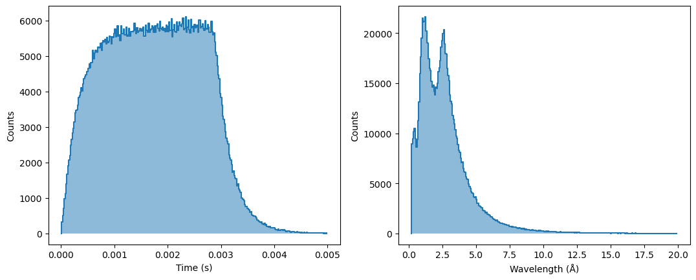
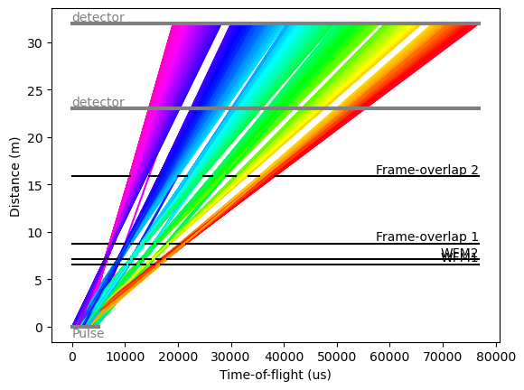
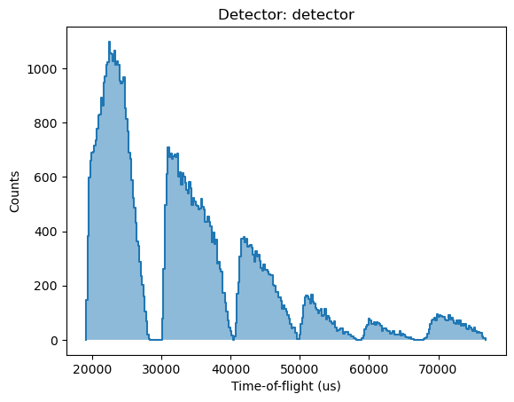

[](https://tof.readthedocs.io/en/latest/?badge=latest)

# tof

A simple tool to create time-of-flight chopper cascade diagrams

## Installation

```sh
pip install tof
```

## Documentation

[https://tof.readthedocs.io/](https://tof.readthedocs.io/)

## Example

```Python
import scipp as sc
import tof

Hz = sc.Unit('Hz')
deg = sc.Unit('deg')
meter = sc.Unit('m')

pulse = tof.Pulse(kind='ess', neutrons=1_000_000)

pulse.plot()
```



```Python
choppers = [
    tof.Chopper(
        frequency=70. * Hz,
        open=sc.array(
            dims=['cutout'],
            values=[98.71, 155.49, 208.26, 257.32, 302.91, 345.3],
            unit='deg',
        ),
        close=sc.array(
            dims=['cutout'],
            values=[109.7, 170.79, 227.56, 280.33, 329.37, 375.0],
            unit='deg',
        ),
        phase=47.10 * deg,
        distance=6.6 * meter,
        name="WFM1",
    ),
    tof.Chopper(
        frequency=70 * Hz,
        open=sc.array(
            dims=['cutout'],
            values=[80.04, 141.1, 197.88, 250.67, 299.73, 345.0],
            unit='deg',
        ),
        close=sc.array(
            dims=['cutout'],
            values=[91.03, 156.4, 217.18, 269.97, 322.74, 375.0],
            unit='deg',
        ),
        phase=76.76 * deg,
        distance=7.1 * meter,
        name="WFM2",
    ),
    tof.Chopper(
        frequency=56 * Hz,
        open=sc.array(
            dims=['cutout'],
            values=[74.6, 139.6, 194.3, 245.3, 294.8, 347.2],
            unit='deg',
        ),
        close=sc.array(
            dims=['cutout'],
            values=[95.2, 162.8, 216.1, 263.1, 310.5, 371.6],
            unit='deg',
        ),
        phase=62.40 * deg,
        distance=8.8 * meter,
        name="Frame-overlap 1",
    ),
    tof.Chopper(
        frequency=28 * Hz,
        open=sc.array(
            dims=['cutout'],
            values=[98.0, 154.0, 206.8, 254.0, 299.0, 344.65],
            unit='deg',
        ),
        close=sc.array(
            dims=['cutout'],
            values=[134.6, 190.06, 237.01, 280.88, 323.56, 373.76],
            unit='deg',
        ),
        phase=12.27 * deg,
        distance=15.9 * meter,
        name="Frame-overlap 2",
    ),
]

detectors = [
    tof.Detector(distance=23.0 * meter, name='monitor'),
    tof.Detector(distance=32.0 * meter, name='detector'),
]

model = tof.Model(choppers=choppers, pulse=pulse, detectors=detectors)

model.run()

model.plot(max_rays=10000)
```



```Python
detectors[1].tofs.plot()
```


